# Distributed Job Scheduler — Architecture

> **Status:** Implemented. This document reflects the design as built — see the repo root README for what's running and verified.

A production-grade distributed job scheduler comparable to Temporal, BullMQ, Sidekiq, Celery, and cloud worker systems. Designed for millions of jobs, horizontal scale, atomic execution, and enterprise observability.

---

## Table of Contents

1. [High-Level Architecture](#1-high-level-architecture)
2. [Microservice Architecture](#2-microservice-architecture)
3. [Folder Structure](#3-folder-structure)
4. [Database ER Diagram](#4-database-er-diagram)
5. [Sequence Diagrams](#5-sequence-diagrams)
6. [Worker Lifecycle](#6-worker-lifecycle-diagram)
7. [Job Lifecycle](#7-job-lifecycle-diagram)
8. [Queue Flow](#8-queue-flow-diagram)
9. [Deployment Diagram](#9-deployment-diagram)
10. [Component Rationale](#10-component-rationale)
11. [Frontend Design — Neobrutalism Theme](#11-frontend-design--neobrutalism-theme)
12. [Technology Decisions Summary](#12-technology-decisions-summary)

---

## 1. High-Level Architecture

The system follows a **modular monolith with horizontally scalable worker processes**. The API, scheduler, and workers share the same codebase but run as separate deployable processes — a pragmatic pattern used by Sidekiq (web + workers) and Celery (beat + workers + API).

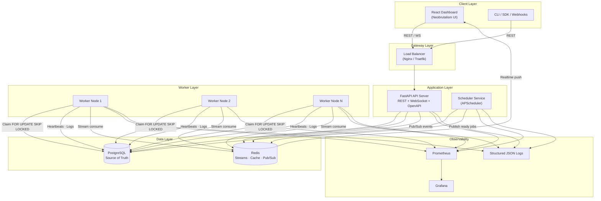

### Design Principles

| Principle | Implementation |
|-----------|----------------|
| **Single source of truth** | PostgreSQL holds all durable state (jobs, queues, workers, audit) |
| **Atomic claiming** | `SELECT … FOR UPDATE SKIP LOCKED` inside a transaction |
| **At-least-once delivery** | Claim + idempotency keys + execution records prevent duplicate side effects |
| **Separation of concerns** | API (control plane) ≠ Scheduler (time plane) ≠ Workers (execution plane) |
| **Fail-safe retries** | Configurable backoff policies with DLQ escape hatch |
| **Observable by default** | Prometheus metrics, structured logs, WebSocket live feed |

---

## 2. Microservice Architecture

Although deployed from one repository, the runtime is split into **five logical services** that can be scaled independently.

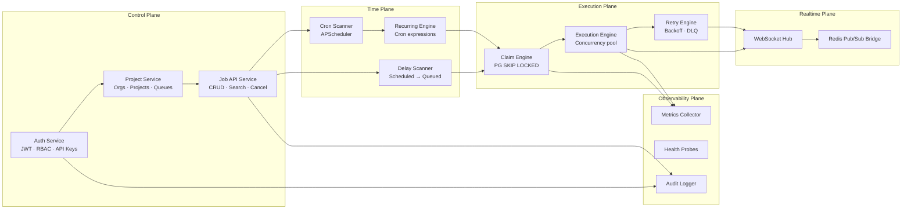

### Service Responsibilities

| Service | Process | Scale Strategy |
|---------|---------|----------------|
| **API Server** | `uvicorn app.main:app` | Horizontal — stateless behind LB |
| **Scheduler** | `python -m app.scheduler.main` | Single leader with Redis distributed lock (optional HA standby) |
| **Worker** | `python -m app.workers.main` | Horizontal — add nodes per queue load |
| **WebSocket** | Embedded in API (or separate if needed) | Sticky sessions or Redis-backed fan-out |
| **Metrics** | `/metrics` endpoint on each process | Scraped by Prometheus |

### Inter-Service Communication

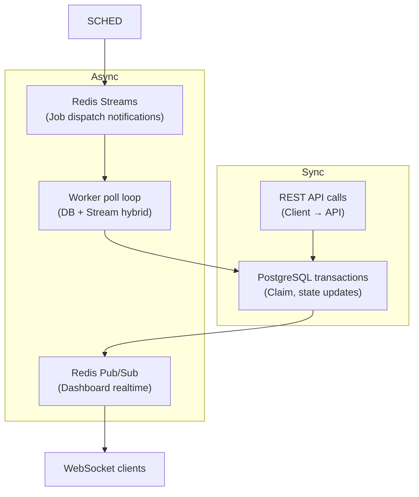

**Hybrid dispatch model:** The scheduler writes job state to PostgreSQL (durable) and publishes a lightweight notification to Redis Streams (fast wake-up). Workers primarily claim from PostgreSQL (correctness) and use Streams as a hint to reduce idle polling latency.

---

## 3. Folder Structure

> This reflects the repository exactly as implemented (verified against the working tree, not the
> pre-implementation plan) — see [github.com/moneshs23/Job-Schedular](https://github.com/moneshs23/Job-Schedular).

```
distributed-job-scheduler/
├── README.md
├── docker-compose.yml
├── .env.example
├── .gitignore
│
├── docs/
│   ├── Architecture.md          ← this document
│   ├── Design-Decisions.md
│   ├── Database.md
│   ├── API.md
│   └── Deployment.md
│
├── docker/
│   └── prometheus/
│       └── prometheus.yml
│
├── backend/
│   ├── pyproject.toml
│   ├── alembic.ini
│   ├── Dockerfile
│   ├── docker-entrypoint.sh
│   ├── migrations/
│   │   ├── env.py
│   │   └── versions/                  # initial schema, queue unique constraint, now() default fix
│   ├── app/
│   │   ├── main.py                    # FastAPI entrypoint
│   │   ├── config/
│   │   │   ├── settings.py            # Pydantic Settings (env-driven)
│   │   │   └── constants.py           # job/worker status enums, Redis key prefixes
│   │   ├── api/
│   │   │   ├── router.py              # Aggregates all routers under /api/v1
│   │   │   └── routes/
│   │   │       ├── auth.py            # register/login/refresh/me/api-keys
│   │   │       ├── organizations.py   # orgs, projects, audit-logs
│   │   │       ├── queues.py          # queues + retry-policies
│   │   │       ├── jobs.py            # jobs + dead-letter-queue
│   │   │       ├── workers.py         # registration, heartbeats, shutdown
│   │   │       ├── dashboard.py       # overview stats
│   │   │       ├── websocket.py       # /ws realtime endpoint
│   │   │       └── health.py          # DB + Redis health check
│   │   ├── auth/
│   │   │   ├── security.py            # JWT issue/verify, bcrypt hashing, API key generation
│   │   │   └── dependencies.py        # Principal resolution, RBAC, project-scope checks
│   │   ├── models/                    # SQLAlchemy 2.0 ORM — 9 files, 15 tables
│   │   │   ├── base.py                # Declarative base, timestamp/UUID mixins
│   │   │   ├── organization.py        # User, Organization, OrganizationMember, Project
│   │   │   ├── queue.py               # Queue, RetryPolicy
│   │   │   ├── job.py                 # Job, ScheduledJob
│   │   │   ├── worker.py              # Worker, WorkerHeartbeat
│   │   │   ├── execution.py           # JobExecution, JobLog
│   │   │   ├── dead_letter.py         # DeadLetterEntry
│   │   │   ├── api_key.py             # APIKey
│   │   │   └── audit.py               # AuditLog
│   │   ├── schemas/                   # Pydantic request/response models (mirrors models/)
│   │   ├── repositories/              # Data-access layer — one repo per model, Repository pattern
│   │   ├── services/                  # Business logic — auth, project, queue, job, worker, dashboard, audit
│   │   ├── scheduler/
│   │   │   ├── main.py                # Scheduler process entrypoint
│   │   │   ├── service.py             # Delay scanner + cron scanner
│   │   │   └── leader.py              # Redis-lock leader election for HA
│   │   ├── workers/
│   │   │   ├── main.py                # Worker process entrypoint (signal handling)
│   │   │   └── worker.py              # Poll → claim → execute → heartbeat → graceful shutdown
│   │   ├── execution/
│   │   │   ├── engine.py              # Runs one claimed job; decides retry vs. dead-letter
│   │   │   └── registry.py            # Pluggable task handlers (echo, sleep, http_request, ...)
│   │   ├── retry/
│   │   │   └── policy.py              # fixed/linear/exponential/custom backoff math
│   │   ├── queues/
│   │   │   ├── redis_client.py
│   │   │   ├── streams.py             # Redis Streams — claim wake-up signal
│   │   │   └── pubsub.py              # Redis Pub/Sub — WebSocket event bus
│   │   ├── websocket/
│   │   │   └── hub.py                 # Connection registry + broadcast
│   │   ├── middleware/
│   │   │   ├── rate_limit.py          # Fixed-window, Redis-backed, per-IP
│   │   │   ├── request_logging.py     # Structured request logs + Prometheus timing
│   │   │   └── exception_handler.py   # Uniform {"error": ...} responses
│   │   ├── database/
│   │   │   └── session.py             # Async engine + session factory
│   │   ├── logging/
│   │   │   └── setup.py               # structlog JSON configuration
│   │   └── monitoring/
│   │       └── metrics.py             # Prometheus counters/histograms
│   └── tests/
│       ├── conftest.py                # Test DB/session/client fixtures
│       ├── unit/
│       │   ├── test_retry_policy.py
│       │   └── test_auth_security.py
│       └── integration/
│           ├── test_claim_engine.py           # Proves SKIP LOCKED never double-claims
│           ├── test_api_job_lifecycle.py
│           ├── test_validation_and_audit.py
│           └── test_schema_defaults.py        # Regression guard for the now() default bug
│
└── frontend/
    ├── package.json
    ├── vite.config.ts
    ├── index.html
    ├── Dockerfile
    ├── nginx.conf
    └── src/
        ├── main.tsx
        ├── App.tsx                   # Routes + provider tree
        ├── index.css                 # Neobrutalism design tokens (theme-aware)
        ├── lib/
        │   ├── api.ts                 # axios instance + refresh-token interceptor
        │   ├── types.ts               # Shared TS types mirroring backend schemas
        │   ├── errors.ts              # Axios error → user-facing message
        │   └── format.ts              # Relative time, duration, number formatting
        ├── hooks/
        │   ├── useRealtime.ts         # WebSocket → React Query cache invalidation
        │   ├── useTheme.ts            # Dark/light toggle, persisted
        │   └── useDebounce.ts
        ├── context/
        │   ├── AuthContext.tsx
        │   ├── ProjectContext.tsx     # Current org/project selection
        │   └── ToastContext.tsx
        ├── components/
        │   ├── Layout.tsx             # Sidebar nav + realtime indicator
        │   ├── ProtectedRoute.tsx
        │   └── ui/                    # Button, Card, Modal, Badge, ConfirmDialog, Skeleton, Input
        └── pages/
            ├── Login.tsx / Register.tsx
            ├── Dashboard.tsx          # Overview cards, charts, onboarding checklist
            ├── Queues.tsx             # Priority, concurrency, pause/resume, retry policies
            ├── Jobs.tsx / JobDetail.tsx
            ├── Workers.tsx            # Live status + copy-paste start command
            ├── DeadLetterQueue.tsx
            ├── ApiKeys.tsx
            └── AuditLog.tsx
```

---

## 4. Database ER Diagram

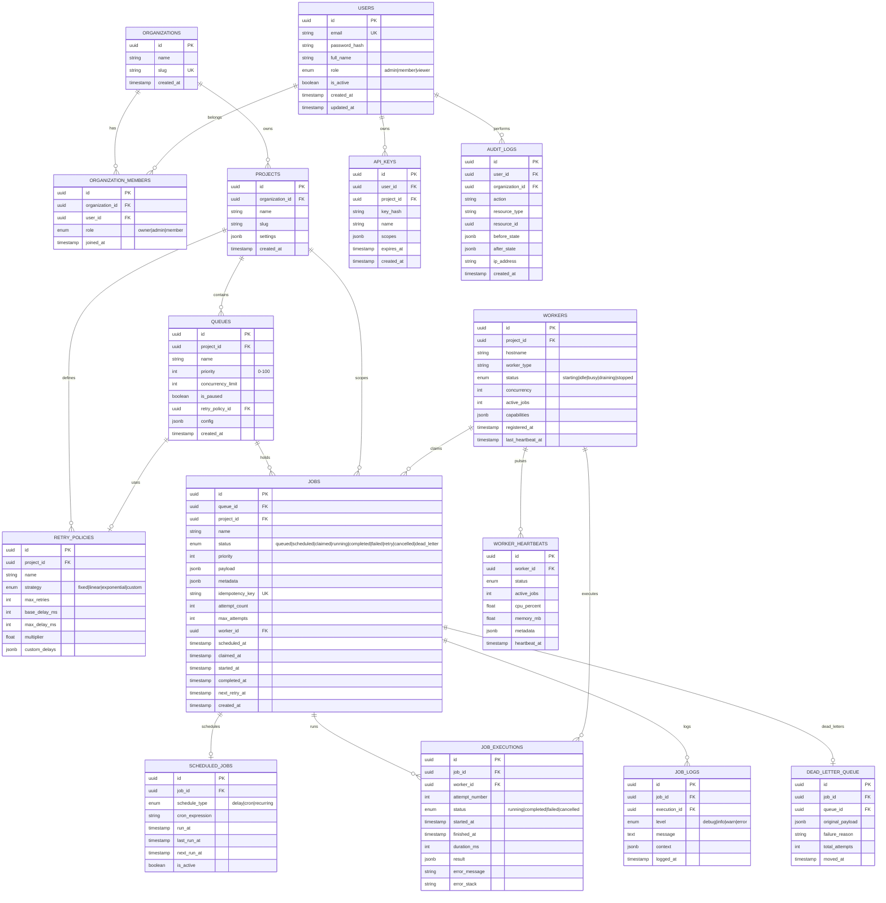

### Key Indexes

| Table | Index | Purpose |
|-------|-------|---------|
| `jobs` | `(queue_id, status, priority DESC, created_at)` | Priority claim query |
| `jobs` | `(status, scheduled_at)` WHERE status = 'scheduled' | Delay scanner |
| `jobs` | `(status, next_retry_at)` WHERE status = 'retry' | Retry scanner |
| `jobs` | `(idempotency_key)` UNIQUE | Dedup |
| `jobs` | `(project_id, status, created_at DESC)` | Dashboard listing |
| `workers` | `(project_id, status, last_heartbeat_at)` | Health checks |
| `job_executions` | `(job_id, attempt_number)` | History lookup |
| `audit_logs` | `(organization_id, created_at DESC)` | Compliance queries |

---

## 5. Sequence Diagrams

### 5.1 Job Creation (Immediate)

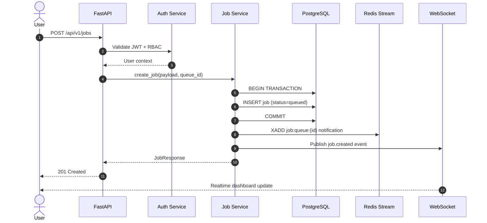

### 5.2 Atomic Job Claim & Execution

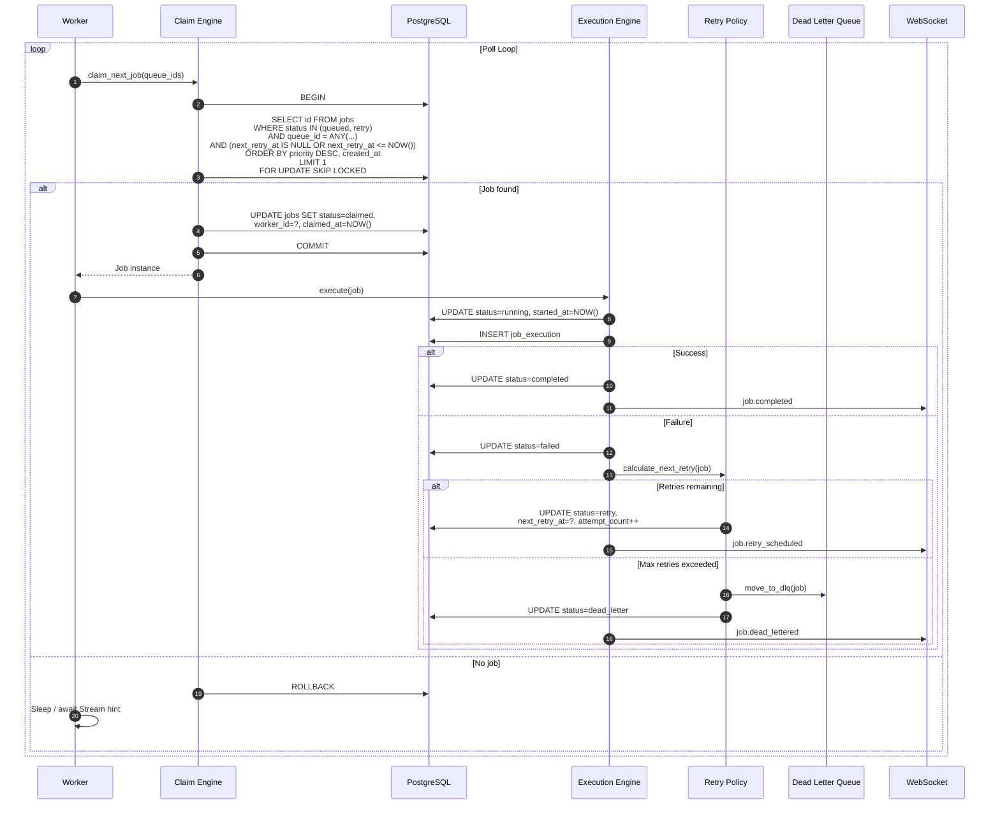

### 5.3 Scheduled / Cron Job Activation

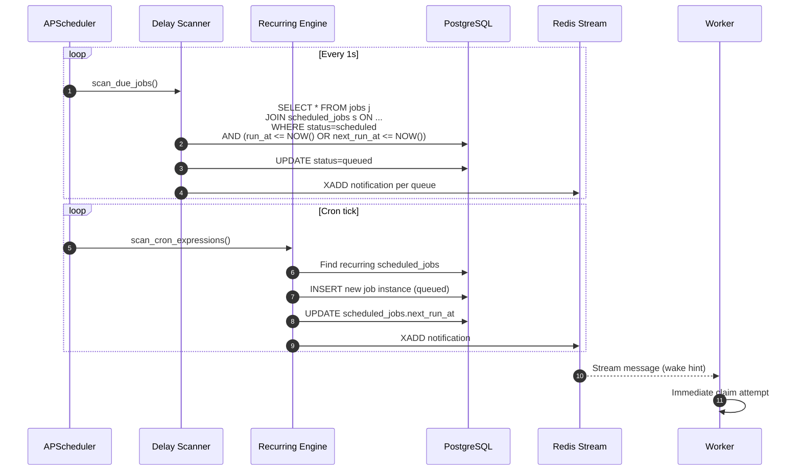

### 5.4 Authentication Flow

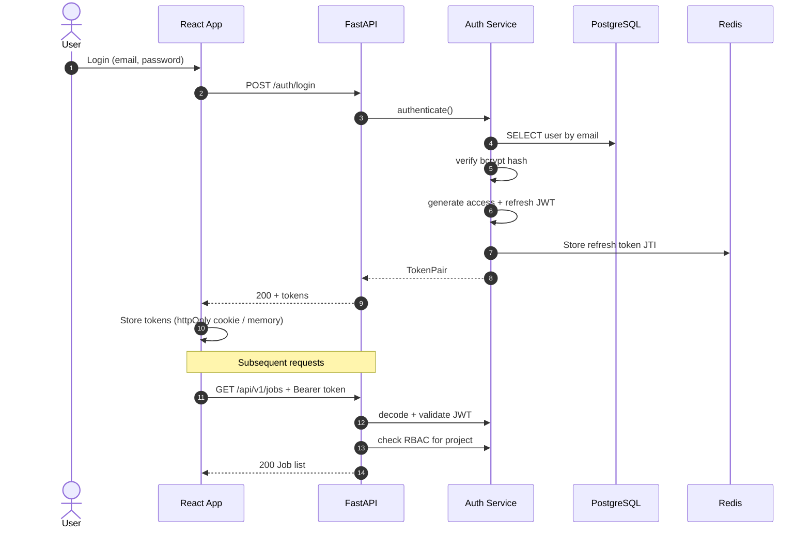

---

## 6. Worker Lifecycle Diagram

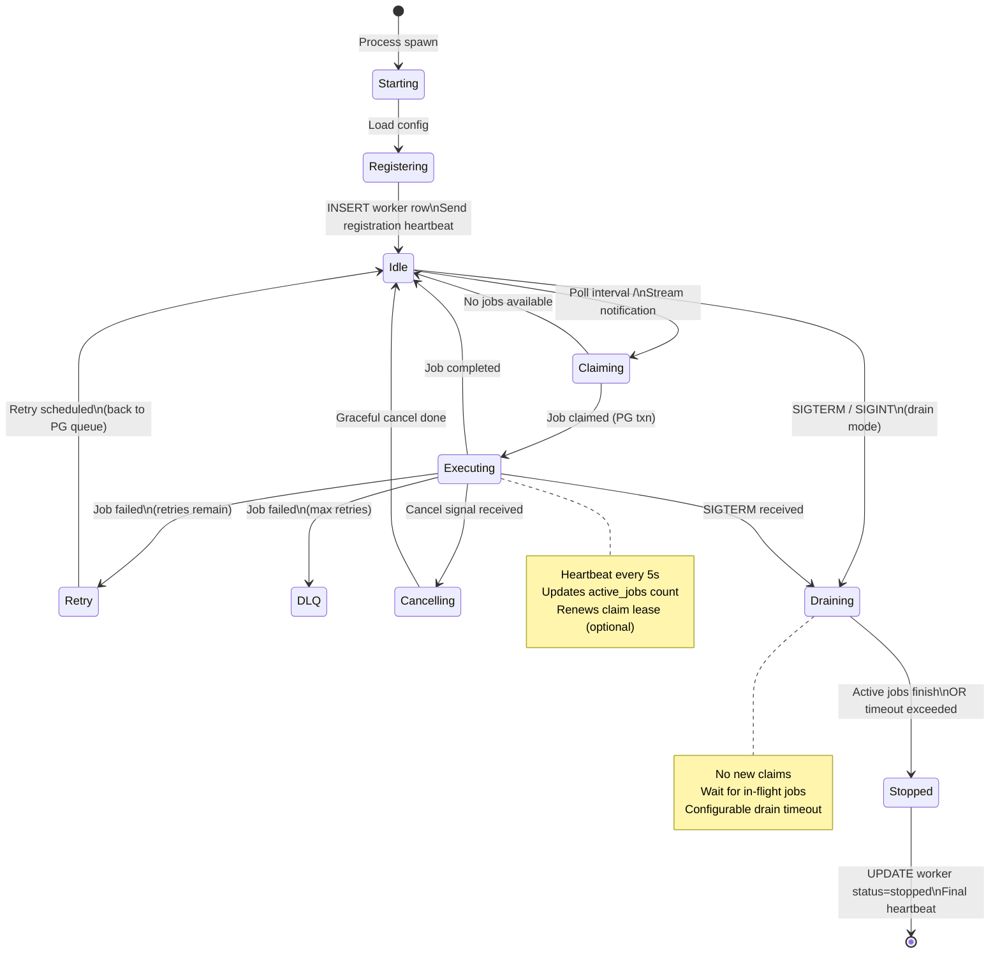

### Worker Internal Architecture

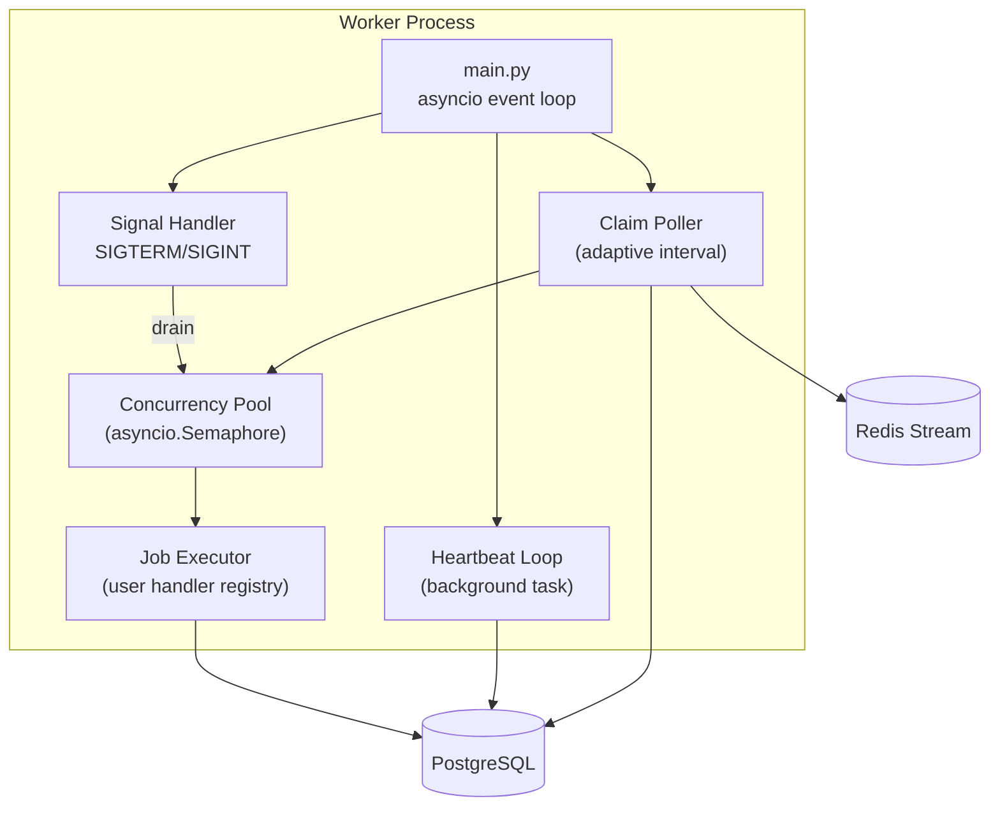

---

## 7. Job Lifecycle Diagram

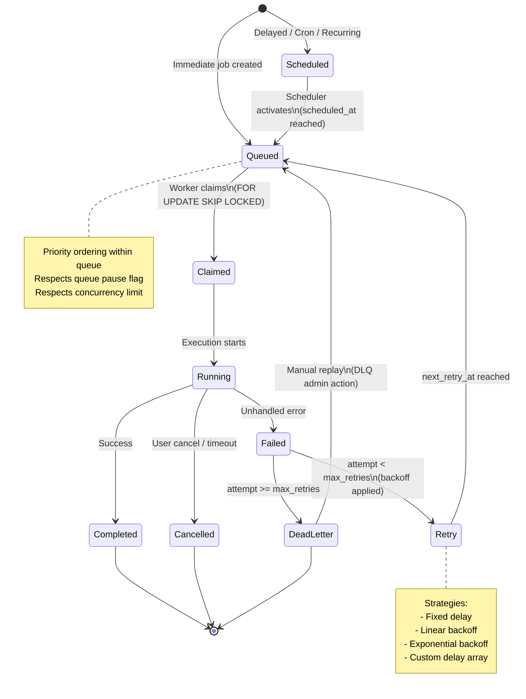

### Job Type Matrix

| Type | Initial State | Trigger | Re-queue |
|------|--------------|---------|----------|
| **Immediate** | `queued` | API create | No |
| **Delayed** | `scheduled` | `scheduled_at` | No |
| **Cron** | `scheduled` | Cron expression | Yes — new instance each tick |
| **Recurring** | `scheduled` | Interval / cron | Yes |
| **Batch** | `queued` (parent) | Parent dispatches children | Children independent |

---

## 8. Queue Flow Diagram

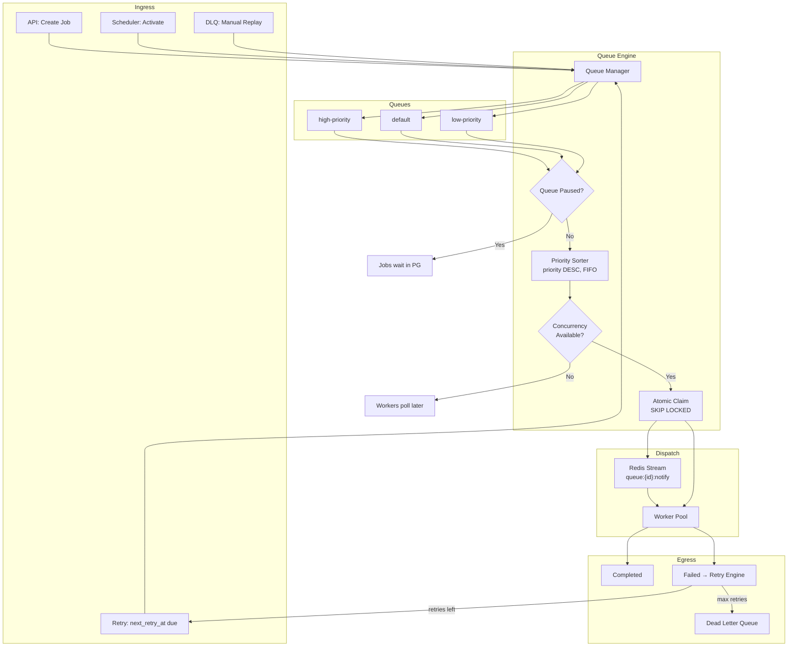

### Priority Queue Implementation

Jobs are **not** stored in Redis priority queues (which lack durability). PostgreSQL holds ordering:

```sql
-- Claim query (simplified)
SELECT j.id
FROM jobs j
JOIN queues q ON j.queue_id = q.id
WHERE j.status IN ('queued', 'retry')
  AND q.is_paused = false
  AND j.queue_id = ANY(:worker_queue_ids)
  AND (j.next_retry_at IS NULL OR j.next_retry_at <= NOW())
ORDER BY j.priority DESC, j.created_at ASC
LIMIT 1
FOR UPDATE OF j SKIP LOCKED;
```

Queue-level `concurrency_limit` is enforced by counting active (`claimed`, `running`) jobs per queue before claim.

---

## 9. Deployment Diagram

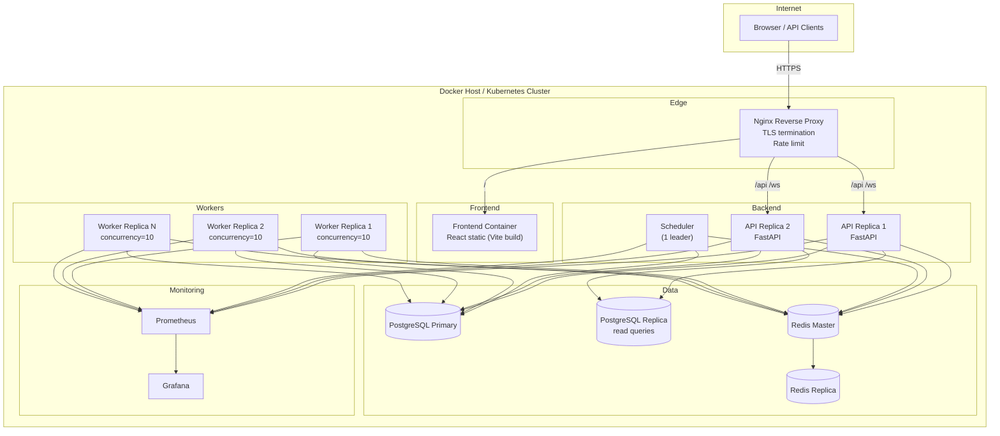

### Docker Compose Services (Development)

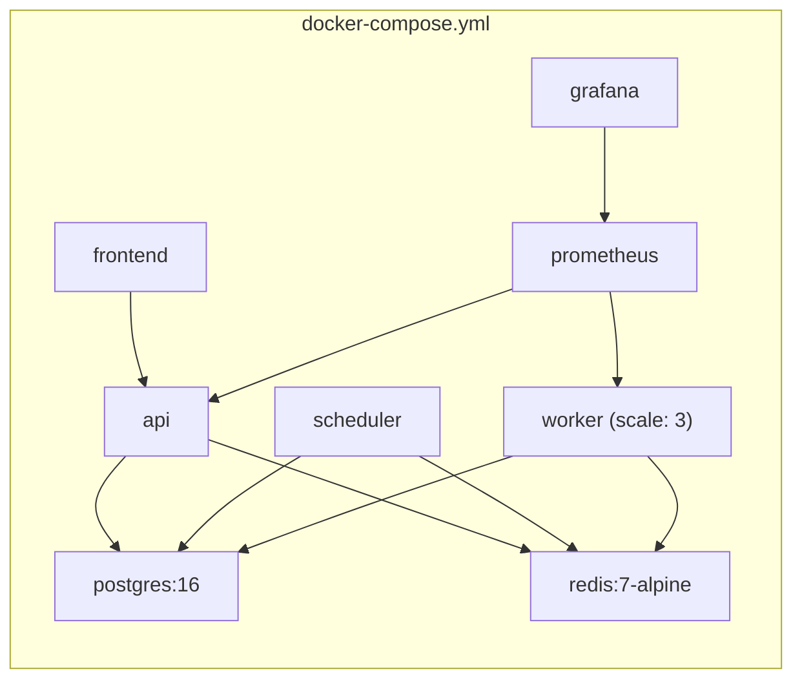

### Environment Profiles

| Profile | API | Scheduler | Workers | Postgres | Redis |
|---------|-----|-----------|---------|----------|-------|
| **dev** | 1 | 1 | 1 | 1 | 1 |
| **staging** | 2 | 1 (+ standby) | 3 | 1 + replica | Sentinel |
| **production** | 3+ | Leader election | Auto-scale | HA cluster | Cluster |

---

## 10. Component Rationale

### Why each component exists

| Component | Why It Exists |
|-----------|---------------|
| **React Dashboard** | Operators need visibility into queues, workers, failures, and throughput without querying SQL. Neobrutalism theme provides high-contrast, scannable enterprise UI. |
| **FastAPI API** | Typed, async, auto-documented REST + WebSocket hub. Control plane for all job/queue/worker operations. |
| **PostgreSQL** | ACID transactions for atomic job claiming. Relational model fits orgs → projects → queues → jobs hierarchy. `SKIP LOCKED` is the industry-standard pattern (used by Graphile Worker, River, etc.). |
| **Redis Streams** | Low-latency wake-up notifications so workers don't hammer DB on idle polls. Stream consumer groups allow partitioned dispatch. |
| **Redis Cache** | JWT blocklist, rate limit counters, dashboard metric snapshots, distributed lock for scheduler leader. |
| **Redis Pub/Sub** | Fan-out realtime events to WebSocket connections across API replicas. |
| **APScheduler** | Battle-tested cron/interval scanning. Runs in dedicated scheduler process to keep API latency isolated. |
| **Scheduler Service** | Separates time-based activation from request handling. Scans `scheduled` → `queued` transitions without blocking API. |
| **Worker Processes** | Horizontally scalable execution plane. Crash of one worker doesn't affect others; unclaimed jobs remain in PG. |
| **Claim Engine** | Encapsulates `FOR UPDATE SKIP LOCKED` logic — the core correctness primitive preventing duplicate execution. |
| **Execution Engine** | Runs job handlers with concurrency control, cancellation, timeout, and result persistence. |
| **Retry Engine** | Centralizes backoff math (fixed/linear/exponential/custom). Keeps worker code simple. |
| **Dead Letter Queue** | Failed jobs need a quarantine area for inspection, alerting, and manual replay — not silent loss. |
| **Heartbeat System** | Detects stale workers. Enables orchestrator to mark crashed workers and optionally release stale claims. |
| **WebSocket Hub** | Dashboard expects live updates (job state changes, worker status) without polling. |
| **Repository Pattern** | Decouples SQL from business logic. Enables unit testing services with mock repos. |
| **Service Layer** | Orchestrates transactions, validation, and cross-entity rules (e.g., can't enqueue to paused queue). |
| **Prometheus Metrics** | Industry standard for alerting on queue depth, failure rate, worker count, claim latency. |
| **Structured JSON Logs** | Machine-parseable logs for ELK/Datadog. Correlation IDs tie API request → job → execution. |
| **JWT + Refresh Tokens** | Stateless auth for API with revocable refresh via Redis. |
| **RBAC** | Multi-tenant org/project isolation. Roles: owner, admin, member, viewer. |
| **API Keys** | Machine-to-machine job submission without user sessions. |
| **Audit Logs** | Compliance trail for who changed queue config, replayed DLQ jobs, etc. |
| **Alembic Migrations** | Version-controlled schema evolution for production deployments. |
| **Nginx** | TLS, routing, rate limiting at edge. Serves static frontend separately from API. |

### Bonus Features — Architecture Hooks

| Feature | Approach |
|---------|----------|
| **Workflow DAG** | `jobs.metadata.parent_job_id` + dependency table; child jobs start when parent completes |
| **Queue Sharding** | `queues.config.shard_key` — workers subscribe to shard subsets |
| **Distributed Locking** | Redis Redlock for scheduler leader election |
| **Leader Election** | Scheduler standby acquires lock; only leader runs cron scans |
| **AI Failure Summary** | Post-execution hook sends error stack to LLM endpoint; stores summary in `job_executions.result` |
| **Execution Replay** | DLQ → clone job with new idempotency key → re-enqueue |
| **Priority Inheritance** | Child jobs inherit parent priority unless overridden |
| **Rate Limiting** | Redis sliding window per org/project on API; per-queue token bucket for job creation |

---

## 11. Frontend Design — Neobrutalism Theme

The dashboard uses **Neobrutalism** — bold borders, hard shadows, high contrast, flat colors — applied on top of ShadCN UI primitives.

### Design Tokens

```css
/* Core neobrutalism tokens */
--neo-border: 3px solid #000;
--neo-shadow: 4px 4px 0px #000;
--neo-shadow-hover: 6px 6px 0px #000;
--neo-radius: 0px;           /* Sharp corners */
--neo-bg: #FFFDF5;           /* Warm off-white */
--neo-primary: #FF6B35;      /* Orange accent */
--neo-secondary: #004E89;    /* Deep blue */
--neo-success: #06D6A0;
--neo-warning: #FFD166;
--neo-danger: #EF476F;
--neo-muted: #F0EDE5;
--neo-font: 'Space Grotesk', sans-serif;
```

### Dashboard Layout

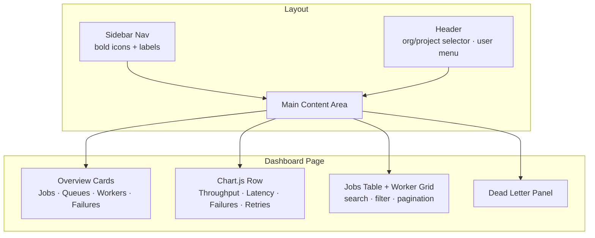

### Key UI Components

| Component | Purpose |
|-----------|---------|
| `NeoCard` | Wrapper with 3px border + offset shadow |
| `NeoButton` | ShadCN Button with brutal shadow + press animation |
| `OverviewCards` | 4-up grid: total jobs, active workers, queue depth, failure rate |
| `ThroughputChart` | Jobs/min line chart (Chart.js) |
| `JobsTable` | Sortable, filterable, paginated with status badges |
| `WorkerGrid` | Live heartbeat indicators (green/yellow/red) |
| `RealtimeProvider` | WebSocket context feeding React Query cache invalidation |

---

## 12. Technology Decisions Summary

| Decision | Choice | Alternatives Considered | Rationale |
|----------|--------|------------------------|-----------|
| Job store | PostgreSQL | Redis-only, DynamoDB | ACID claiming, complex queries, audit |
| Wake-up signal | Redis Streams | Polling only, RabbitMQ | Already in stack; persistent consumer groups |
| Claim pattern | SKIP LOCKED | Advisory locks, Redis BRPOPLPUSH | PostgreSQL-native, no extra broker dependency for correctness |
| Scheduler | APScheduler | Celery Beat, custom cron | Lightweight, embeddable, sufficient for scan workloads |
| API framework | FastAPI | Django, Flask | Async, Pydantic, OpenAPI auto-gen |
| Frontend | React + Vite | Next.js | SPA dashboard; no SSR needed |
| Auth | JWT + Refresh | Session cookies only | Stateless API replicas; refresh revocable in Redis |
| Metrics | Prometheus | Datadog agent | Open-source, pull model, Grafana ecosystem |
| Migrations | Alembic | Raw SQL | SQLAlchemy 2.0 integration |

---

## Next Steps

Once this architecture is **approved**, implementation proceeds in phases:

| Phase | Scope | Deliverable |
|-------|-------|-------------|
| **1** | Database schema + migrations + core models | Alembic migrations, SQLAlchemy models |
| **2** | Auth + Organizations + Projects + Queues API | JWT auth, CRUD endpoints |
| **3** | Job engine + claim + state machine + retry | Worker process, claim engine, DLQ |
| **4** | Scheduler (delay, cron, recurring) | APScheduler service |
| **5** | WebSocket + Redis Pub/Sub | Live dashboard feed |
| **6** | Frontend dashboard (neobrutalism) | Full React UI |
| **7** | Observability + Docker Compose | Prometheus, health checks, `docker compose up` |
| **8** | Tests + documentation | Pytest suite, API.md, Deployment.md |

---

**Please review this architecture and confirm approval (or note changes) before implementation begins.**
